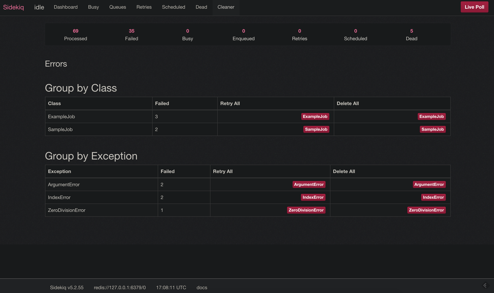

(ReachLocal) Sidekiq Cleaner
==============

For additional documentation, see the [Sidekiq repository](https://github.com/mperham/sidekiq)

Motivation
-----------------
Sidekiq is a very performant library for handling background processing of jobs, but could use with an improved UI for managing job statuses. The Capture team, found ourselves utilizing the [resque-cleaner]() gem frequently to manage our job processing, and felt that this should be included in the Sidekiq library. What is included here is a fork of the Sidekiq library with some tweaks to the `Web` rails engine under a new `Cleaner` namespace.

Installation
-----------------

    gem install sidekiq-cleaner

Usage
-----------------
Mount the Cleaner engine in the `config/routes.rb` file like so:

```ruby
Rails.application.routes.draw do
  mount Sidekiq::Cleaner => '/cleaner'
end
```

The web UI should appear familiar to users of the Sidekiq job library - the only difference is that a new Cleaner tab is introduced:


This tab introduces a useful UI for managing job failures (as filtered by class and exception) en masse - which was only supported for one-off retries and deletes in the vanilla library. Perhaps a future release of Sidekiq will improve on this functionality!



Useful resources:

* Product documentation is in the [wiki](https://github.com/mperham/sidekiq/wiki).
* Release announcements are made to the [@sidekiq](https://twitter.com/sidekiq) Twitter account.
* The [Sidekiq tag](https://stackoverflow.com/questions/tagged/sidekiq) on Stack Overflow has lots of useful Q &amp; A.

Thanks
-----------------

Sidekiq stays fast by using the [JProfiler java profiler](http://www.ej-technologies.com/products/jprofiler/overview.html) to find and fix
performance problems on JRuby.  Unfortunately MRI does not have good multithreaded profiling tools.


License
-----------------

MIT


Author
-----------------

Dan Belling, [danhbelling@gmail.com](mailto:danhbelling@gmail.com), [http://www.danbelling.me](http://danbelling.me)
